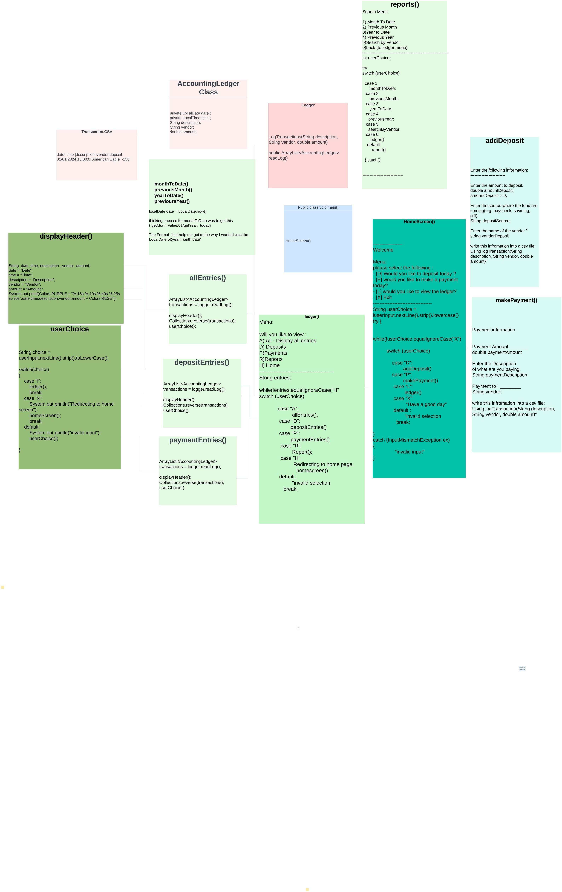
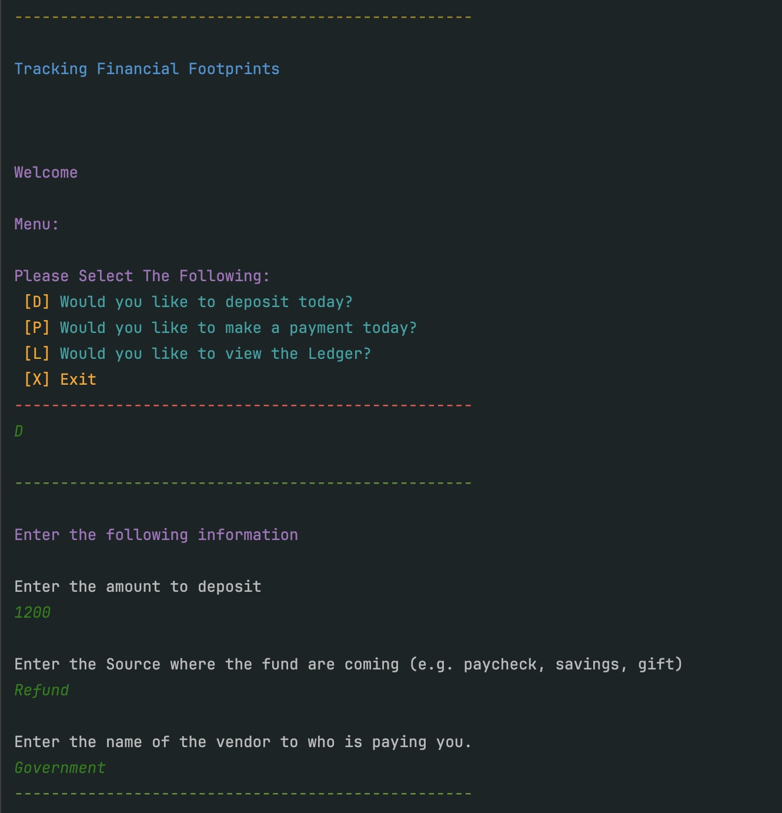
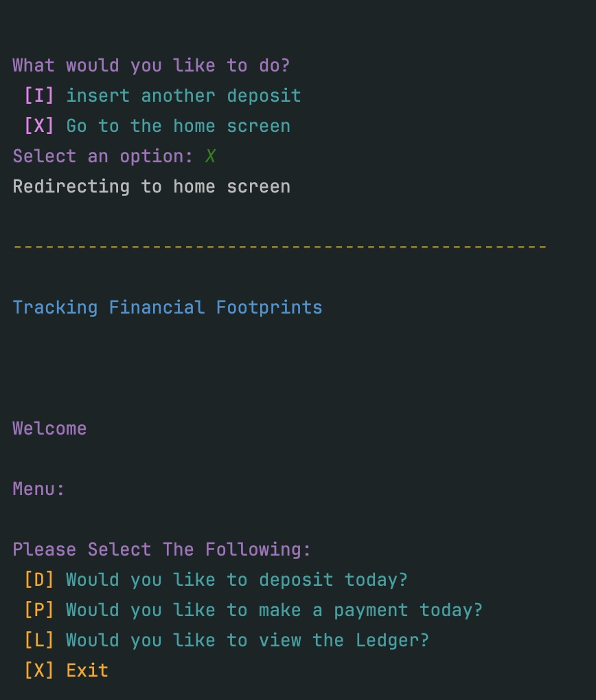
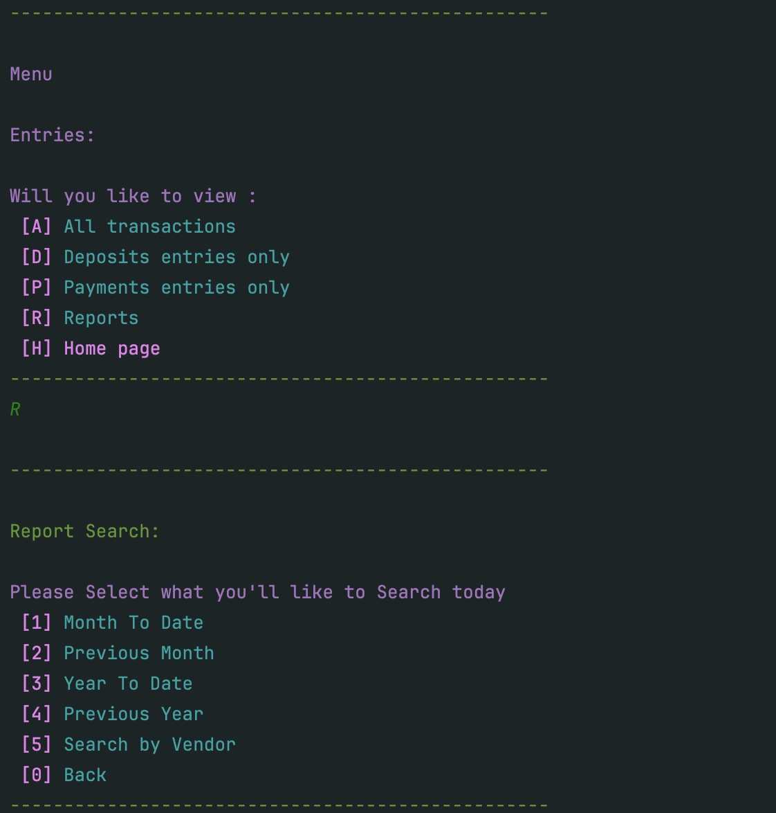
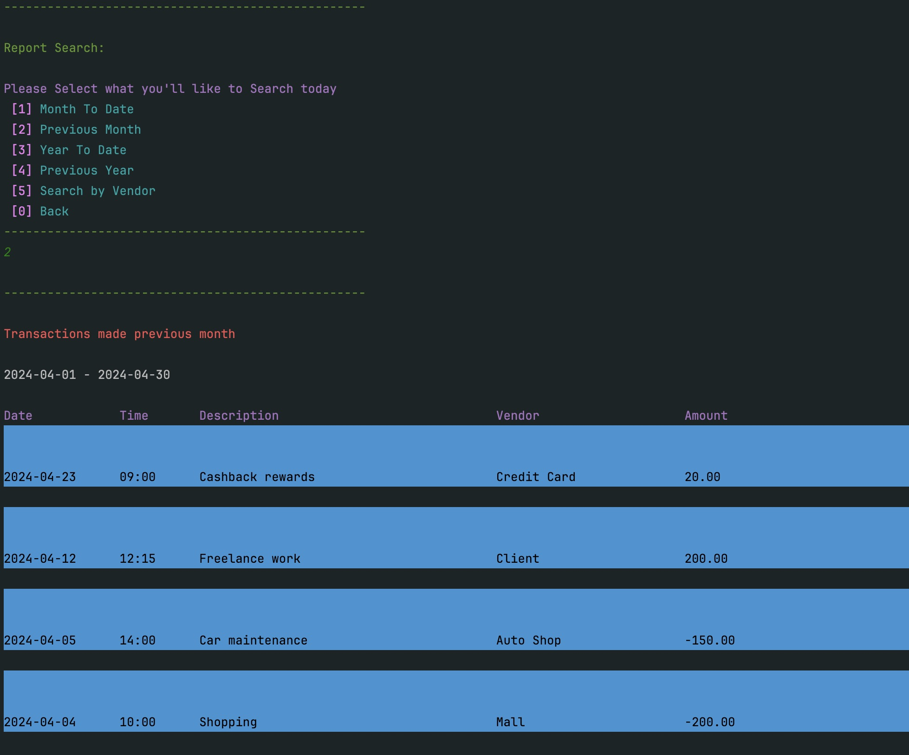
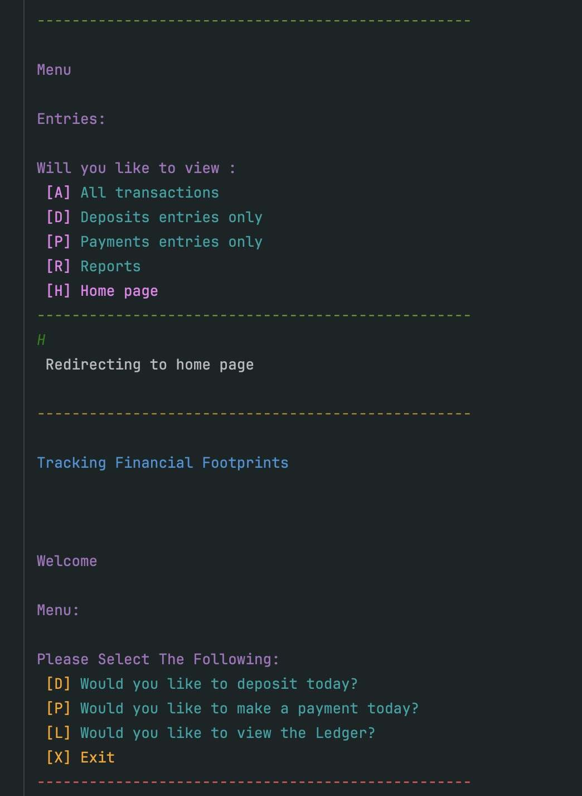
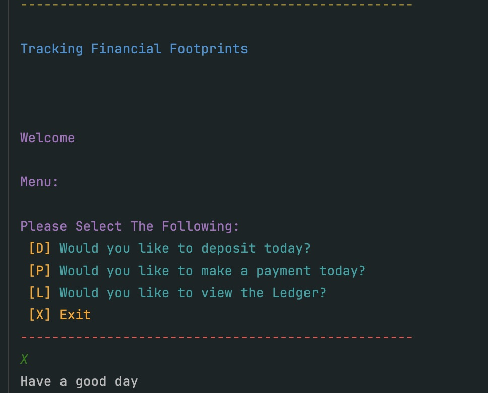

# Accounting-Ledger-Application

The Accounting Ledger application, named Tracking Financial Footprints, keeps track of all your deposits and payments. In addition to this, the Accounting Ledger also includes a unique feature of providing you with various types of reports with detailed information about a purchase and deposits being made. This information is recorded in a transaction file with date, time, and a short description about the transaction. It also includes the vendor name and the amount that was entered.

Thinking process

SHORT DEMO: 
How to use the  Tracking Financial Footprints: 

- Enter D (To deposit)

- Enter X (To return to home)

- Enter L (To view the Ledger)
The Ledger displays the different types of Entries from all transaction to Only deposit and Payments

- Enter D (To view the Deposit Entries only)

- Enter L (To go back to the entries)

- Enter R (To go into Reports)

- Enter 2 (To view previous month Transactions)

- Enter R (To go back to the Report)

- Enter 0 (To go back to Entries)

- Enter H (To go to Home)

- Enter X (To exit the Tracking Financial Footprints)

